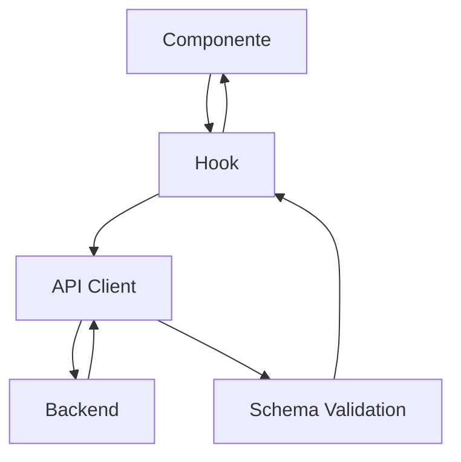

# Frontend Architecture

## Visão Geral

O frontend do Gerenciador Financeiro é construído com **Next.js 14**, utilizando o App Router para roteamento e React Server/Client Components. A aplicação segue uma arquitetura modular focada em manutenibilidade e escalabilidade.

## Stack Tecnológica

| Tecnologia | Versão | Propósito |
|------------|--------|-----------|
| Next.js | 14+ | Framework React |
| React | 18+ | UI Library |
| TypeScript | 5+ | Tipagem estática |
| Tailwind CSS | 3+ | Estilização |
| Zod | 3+ | Validação de schemas |
| Axios | 1+ | Cliente HTTP |
| React Query | - | Gerenciamento de estado (opcional) |

## Estrutura de Pastas

```
frontend/src/
├── app/                      # Next.js App Router
│   ├── (auth)/               # Rotas autenticadas
│   │   ├── dashboard/
│   │   ├── expenses/
│   │   │   ├── overview/
│   │   │   ├── transactions/
│   │   │   ├── payment-methods/
│   │   │   └── recurring/
│   │   ├── investments/
│   │   └── settings/
│   ├── (public)/             # Rotas públicas
│   │   ├── login/
│   │   └── register/
│   ├── layout.tsx            # Layout raiz
│   ├── page.tsx              # Página inicial
│   └── globals.css           # Estilos globais
│
├── components/               # Componentes reutilizáveis
│   ├── ui/                   # Componentes de UI base
│   │   ├── Button.tsx
│   │   ├── Card.tsx
│   │   ├── Input.tsx
│   │   └── Table.tsx
│   └── [feature]/            # Componentes por feature
│
├── context/                  # React Contexts
│   └── ThemeContext.tsx
│
├── hooks/                    # Custom Hooks
│   └── api/                  # Hooks de API
│       ├── useAuth.ts
│       ├── useExpenses.ts
│       ├── usePaymentMethods.ts
│       ├── useRecurringExpenses.ts
│       ├── useInvestments.ts
│       └── useDashboard.ts
│
└── lib/                      # Utilitários e configurações
    ├── api/                  # Camada de API
    │   ├── client.ts         # Cliente HTTP configurado
    │   ├── api-utils.ts      # Utilitários (conversão, validação)
    │   ├── auth.api.ts
    │   ├── expenses.api.ts
    │   ├── payment-methods.api.ts
    │   ├── recurring-expenses.api.ts
    │   ├── investments.api.ts
    │   └── dashboard.api.ts
    │
    ├── schemas/              # Schemas Zod
    │   ├── auth.schema.ts
    │   ├── expense.schema.ts
    │   ├── payment-method.schema.ts
    │   ├── recurring-expense.schema.ts
    │   ├── investment.schema.ts
    │   └── dashboard.schema.ts
    │
    ├── data-managers/        # Gerenciadores de dados
    │   └── dashboard.data-manager.ts
    │
    └── styles/               # Configurações de estilo
        └── colors.ts
```

## Arquitetura em Camadas

### 1. Camada de Apresentação (Pages/Components)

Localização: `app/` e `components/`

Responsabilidades:
- Renderização de UI
- Interação com usuário
- Gerenciamento de estado de UI

```tsx
'use client';

export default function ExpensesPage() {
  const { expenses, loading, createExpense } = useExpenses();
  
  return (
    <div>
      {loading ? <Spinner /> : <ExpenseList expenses={expenses} />}
    </div>
  );
}
```

### 2. Camada de Hooks (State Management)

Localização: `hooks/api/`

Responsabilidades:
- Encapsular lógica de estado
- Gerenciar loading/error states
- Expor operações CRUD

```tsx
export function useExpenses(filters?: ExpenseFilters) {
  const [expenses, setExpenses] = useState<Expense[]>([]);
  const [loading, setLoading] = useState(true);
  const [error, setError] = useState<string | null>(null);

  const fetchExpenses = useCallback(async () => {
    setLoading(true);
    const data = await expensesApi.getAll(filters);
    setExpenses(data);
    setLoading(false);
  }, [filters]);

  return { expenses, loading, error, createExpense, updateExpense, deleteExpense };
}
```

### 3. Camada de API (HTTP Client)

Localização: `lib/api/`

Responsabilidades:
- Comunicação HTTP
- Conversão de dados (snake_case ↔ camelCase)
- Validação de respostas

```tsx
export const expensesApi = {
  getAll: async (filters?: ExpenseFilters): Promise<Expense[]> => {
    const response = await apiClient.get('/expenses', { params: filters });
    return safeParseArrayWithFallback(expenseSchema, response.data);
  },
};
```

### 4. Camada de Schemas (Validação)

Localização: `lib/schemas/`

Responsabilidades:
- Definir tipos TypeScript
- Validar dados com Zod
- Documentar estrutura de dados

```tsx
export const expenseSchema = z.object({
  id: z.string().uuid(),
  name: z.string().min(1).max(100),
  value: z.number().positive(),
  // ...
});

export type Expense = z.infer<typeof expenseSchema>;
```

## Fluxo de Dados



1. **Componente** chama função do hook
2. **Hook** usa API client para fazer requisição
3. **API Client** converte dados e envia para backend
4. **Backend** processa e retorna resposta
5. **Schema** valida dados recebidos
6. **Hook** atualiza estado local
7. **Componente** re-renderiza com novos dados

## Padrões de Código

### Nomenclatura de Arquivos

| Tipo | Padrão | Exemplo |
|------|--------|---------|
| Componente | PascalCase | `ExpenseCard.tsx` |
| Hook | camelCase com use | `useExpenses.ts` |
| API | kebab-case.api | `expenses.api.ts` |
| Schema | kebab-case.schema | `expense.schema.ts` |
| Página | page.tsx | `app/expenses/page.tsx` |

### Componentes

```tsx
// Componentes client-side
'use client';

import { useState } from 'react';

interface Props {
  expense: Expense;
  onEdit: (expense: Expense) => void;
}

export function ExpenseCard({ expense, onEdit }: Props) {
  // ...
}
```

### Hooks Personalizados

```tsx
// Padrão para hooks de API
export function useResource() {
  const [data, setData] = useState<Data[]>([]);
  const [loading, setLoading] = useState(true);
  const [error, setError] = useState<string | null>(null);

  const fetch = useCallback(async () => { /* ... */ }, []);
  const create = async (data: CreateInput) => { /* ... */ };
  const update = async (id: string, data: UpdateInput) => { /* ... */ };
  const remove = async (id: string) => { /* ... */ };

  return {
    data,
    loading,
    error,
    create,
    update,
    remove,
    refetch: fetch,
  };
}
```

## Autenticação

### Fluxo de Login

1. Usuário preenche formulário de login
2. `authApi.login()` envia credenciais
3. Token JWT é salvo no `localStorage`
4. `apiClient` interceptor adiciona token em todas as requisições

### Proteção de Rotas

O layout `(auth)/layout.tsx` verifica autenticação:

```tsx
export default function AuthLayout({ children }) {
  const { isAuthenticated, loading } = useAuth();
  
  if (loading) return <Loading />;
  if (!isAuthenticated) redirect('/login');
  
  return <>{children}</>;
}
```

## Temas e Estilos

### ThemeContext

```tsx
const { theme, toggleTheme, getThemeColor } = useTheme();
```

### Sistema de Cores

```tsx
import { colors } from '@/lib/styles/colors';

// Uso
<div style={{ color: getThemeColor(colors.text.primary) }}>
```

## Responsividade

### useViewport Hook

```tsx
const { isLaptop, isMobile } = useViewport();

const styles = {
  padding: isLaptop ? '16px' : '24px',
  fontSize: isLaptop ? '14px' : '16px',
};
```

## Boas Práticas

### 1. Separação de Responsabilidades
- Componentes focam em UI
- Hooks encapsulam lógica
- APIs lidam com HTTP

### 2. Tipagem Forte
- Use Zod schemas para runtime validation
- Infira tipos dos schemas

### 3. Tratamento de Erros
- Sempre use try/catch nos hooks
- Exiba mensagens amigáveis ao usuário

### 4. Loading States
- Mostre feedback durante operações
- Use skeletons para listas

### 5. Otimização
- Use `useCallback` para funções
- Use `useMemo` para cálculos pesados
